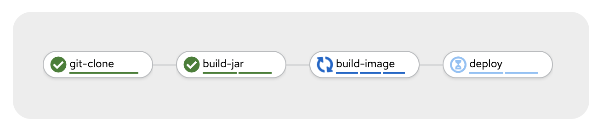

# Tekton Pipelines PetClinic Demo



Install demo:
```
$ oc new-project demo
$ oc create -f petclinic-pipeline-all.yaml
```

Start pipeline
```
$ tkn p start petclinic-deploy --use-param-defaults -w name=maven-cache,claimName=maven-cache-pvc -w name=app-source,claimName=app-source-pvc -w name=maven-settings,config=maven-settings
```