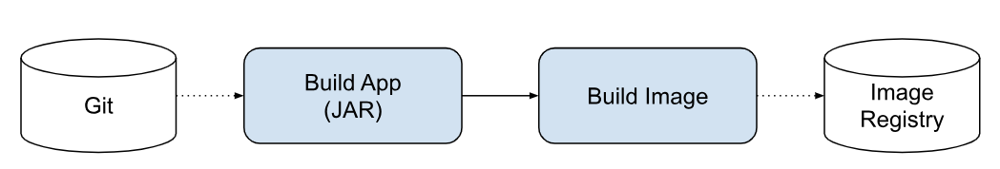
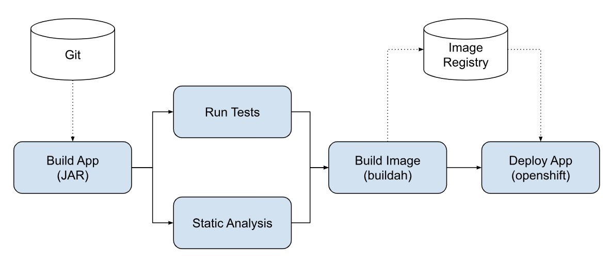

# Tekton Pipeline Examples


## Pre-requisites
* [OpenShift 4 cluster](http://cloud.redhat.com)
* [Tekton CLI](https://github.com/tektoncd/cli/releases/latest)

## Prepare Project

```
oc new-project pipeline-demo

# create pipline tasks and resources

oc create -f tasks
oc create -f https://raw.githubusercontent.com/tektoncd/catalog/master/buildah/buildah.yaml
oc create -f https://raw.githubusercontent.com/tektoncd/catalog/master/openshift-client/openshift-client-task.yaml
oc create -f pipelines/mapit-resources.yml
```

## MapIt Build Pipeline



```
oc create -f pipelines/build-pipeline.yml
tkn pipeline start build-pipeline
```

## MapIt Deploy Pipeline



```
# deploy mapit
oc apply -f apps/mapit-spring.yml

# create pipeline
oc apply -f pipelines/deploy-pipeline.yml
tkn pipeline start deploy-pipeline
```

# PetClinic Pipeline Demo

```
oc apply -f pipelines/petclinic-all.yml
tkn pipeline start petclinic-deployment-pipeline -n pipelines-demo
```