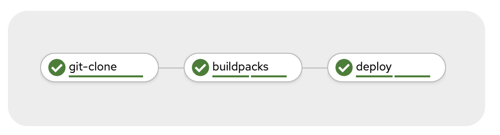

# Tekton Pipelines Example - Cloud-Native Buildpacks



Install demo:
```
$ oc new-project demo
$ oc create -f tasks/
$ oc create -f conf/
$ oc create -f pipelines/cf-nodejs-pipeline.yaml
```

Start pipeline
```
$ oc create -f pipelines/cf-nodejs-pipeline-run.yaml
```